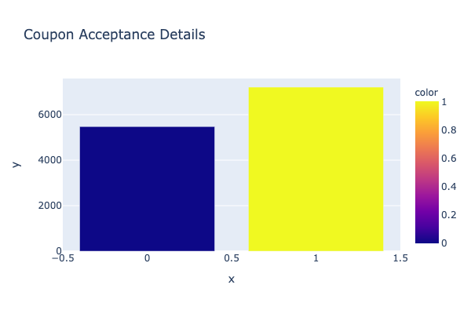
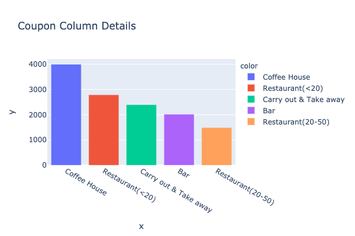
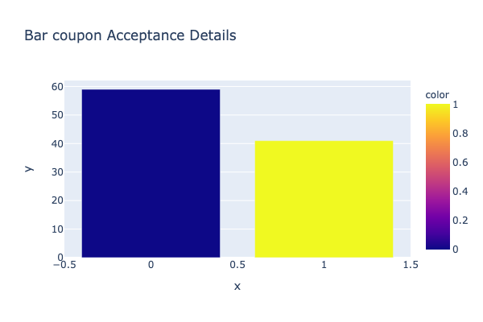
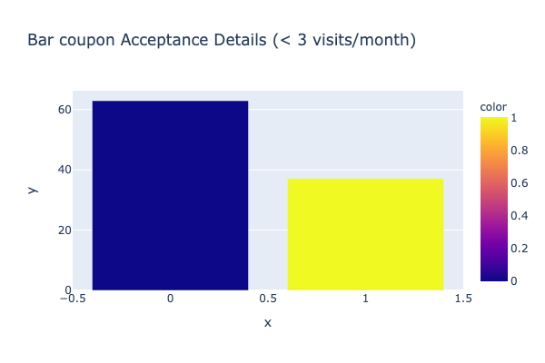
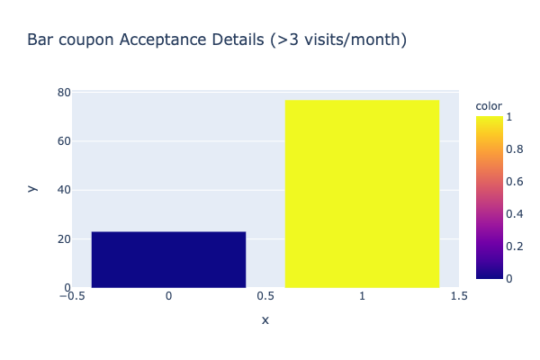
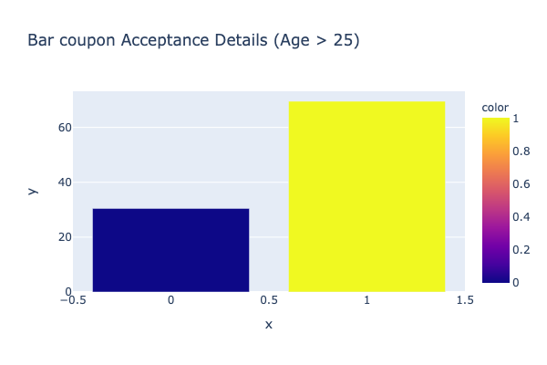
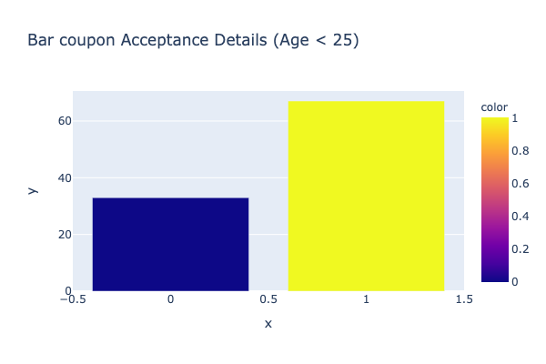
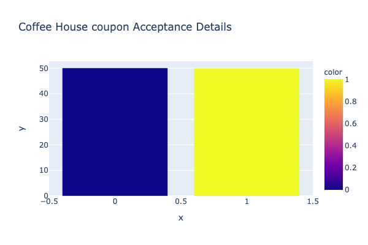
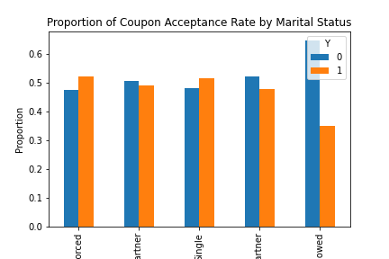
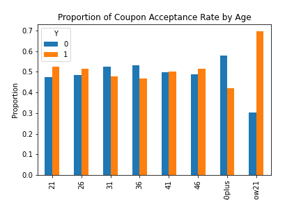

# Will a Customer Accept the Coupon?

**Overview**

The goal of this project is to use what you know about visualizations and probability distributions to distinguish between customers who accepted a driving coupon versus those who did not.
Scenario #1: Customers who accept the bar coupons based on age, occupation, frequency of their visits.  
Scenraio #2: Customers who accept the Coffee House coupons based on age, occupation, frequency of their visits. 

**Data**

This data comes to us from the UCI Machine Learning repository and was collected via a survey on Amazon Mechanical Turk. The survey describes different driving scenarios including the destination, current time, weather, passenger, etc., and then ask the person whether he will accept the coupon if he is the driver. Answers that the user will drive there ‘right away’ or ‘later before the coupon expires’ are labeled as ‘Y = 1’ and answers ‘no, I do not want the coupon’ are labeled as ‘Y = 0’.  There are five different types of coupons -- less expensive restaurants (under $20), coffee houses, carry out & take away, bar, and more expensive restaurants ($20 - $50).

### Data Description
Keep in mind that these values mentioned below are average values.

The attributes of this data set include:
1. User attributes
    -  Gender: male, female
    -  Age: below 21, 21 to 25, 26 to 30, etc.
    -  Marital Status: single, married partner, unmarried partner, or widowed
    -  Number of children: 0, 1, or more than 1
    -  Education: high school, bachelors degree, associates degree, or graduate degree
    -  Occupation: architecture & engineering, business & financial, etc.
    -  Annual income: less than $12500 , $12500 - $24999, $25000 - $37499, etc.
    -  Number of times that he/she goes to a bar: 0, less than 1, 1 to 3, 4 to 8 or greater than 8
    -  Number of times that he/she buys takeaway food: 0, less than 1, 1 to 3, 4 to 8 or greater
       than 8
    -  Number of times that he/she goes to a coffee house: 0, less than 1, 1 to 3, 4 to 8 or
       greater than 8
    -  Number of times that he/she eats at a restaurant with average expense less than $20 per
       person: 0, less than 1, 1 to 3, 4 to 8 or greater than 8
    -  Number of times that he/she goes to a bar: 0, less than 1, 1 to 3, 4 to 8 or greater than 8
   
2. Contextual attributes
    - Driving destination: home, work, or no urgent destination
    - Location of user, coupon and destination: we provide a map to show the geographical
      location of the user, destination, and the venue, and we mark the distance between each
      two places with time of driving. The user can see whether the venue is in the same
      direction as the destination.
    - Weather: sunny, rainy, or snowy
    - Temperature: 30F, 55F, or 80F
    - Time: 10AM, 2PM, or 6PM
    - Passenger: alone, partner, kid(s), or friend(s)

3. Coupon attributes
    - time before it expires: 2 hours or one day

## I. Initial Analysis

#### 1. What proportion of the total observations chose to accept the coupon?

The coupon acceptance rate is **56.84%**.

The accepted coupons are distributed as follows:

Overall, **Coffee House** coupons have the best acceptance. 'Bar' and 'Coffee House' they will be further analyzed below.

## II. Bar coupons analysis

#### 1. What proportion of bar coupons were accepted?

**41.00%** of bar coupons were accepted.

#### 2. Identifying behavior around bar attendance

**2.1 Behaviour Analysis - Frequency of visits**

The acceptance of Bar coupons is primarily influenced by driver frequency to Bar.  

The acceptance rate increases when there are more than 3 visits a month.

For visits less than 3 times per month, the acceptance rate is: **37.07%**.

For visits more than 3 times per month, the acceptance rate is: **76.88%**

$\color{red}{Analysis}$
**The rate of acceptance increases by over 100% while comparing frequency of visits between less than 3 visits per month to more than 3 visits per month.**

**2.2 Behaviour Analysis - Frequency and age**

For drivers who visit the bar more than once, it was observed that the acceptance rate does not differ with Age.

For visits more than once per month and Age > 25, the acceptance rate is: **69.52%**.

For visits more than once per month and Age < 25, the acceptance rate is: **67.04%**.

$\color{red}{Analysis}$
**There is a marginal difference in acceptance rates, indicating that drivers who visit the bar more often accept the coupon irrespective of the age.**

**2.3 Behaviour Analysis - Miscl Factors**

Scenario 1: Go to bars more than once a month, passenger not a kid: **71.32%**

Scenario 2: Go to bars more than once a month, occupation other than Farming, Fishing and Forestry: **68.79%**

Scenario 3: Go to bars more than once a month, had passengers that were not a kid, and were not widowed: **71.32%**

Scenario 4: Go to bars more than once a month and are under the age of 30: **72.17%**

Scenario 5: Go to cheap restaurants more than 4 times a month and income is less than 50K: **45.35%**

$\color{red}{Summary}$
**The primary factors that impact the acceptance rate of Bar coupons are personal habits (frequency of visits) and income related constraints. Age and occupation related constraints don't impact coupon acceptance rates to a large degree.**

## III. Coffee House coupons analysis

#### 1. What proportion of coffee house coupons were accepted?

**49.9%** of Coffee House coupons were accepted.

#### 2. Identifying passenger profiles around coffee house attendance
**2.1 Behaviour Analysis for Drivers going to the Coffee House**

Acceptance rate for group 1 (3 or fewer visits/month): **44.96%**

Acceptance rate for group 2 (more than 3 visits/month): **67.50%**

$\color{red}{Analysis}$
**Acceptance Rate is higher for drivers who typically visit CoffeeHouse more than 3 times per month.**

Acceptance Rate varies based on marital status of drivers.
Divorced and Single Drivers have an acceptance rate of **52.3%** and **51.6%** respectively. Widowed drivers have the lowest acceptance rate of **35.3%**.

$\color{red}{Analysis}$
**Acceptance Rate is driven by Marital Status.**

Acceptance Rate varies based on Age of drivers.
Drivers below the age of 21 have an acceptance rate of **69.7%**. Drivers above 50 have the lowest acceptance rate of **42.01%**.

$\color{red}{Analysis}$
**Acceptance Rate is driven by Age.**

$\color{green}{Summary}$
**The primary factors that impact the acceptance rate of Coffee House coupons are personal habits (frequency of visits), age and marital status.**